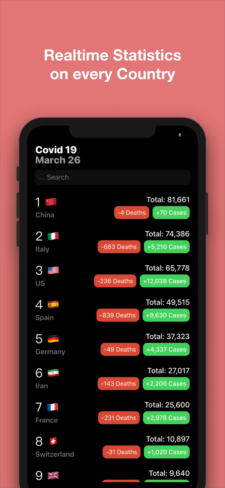
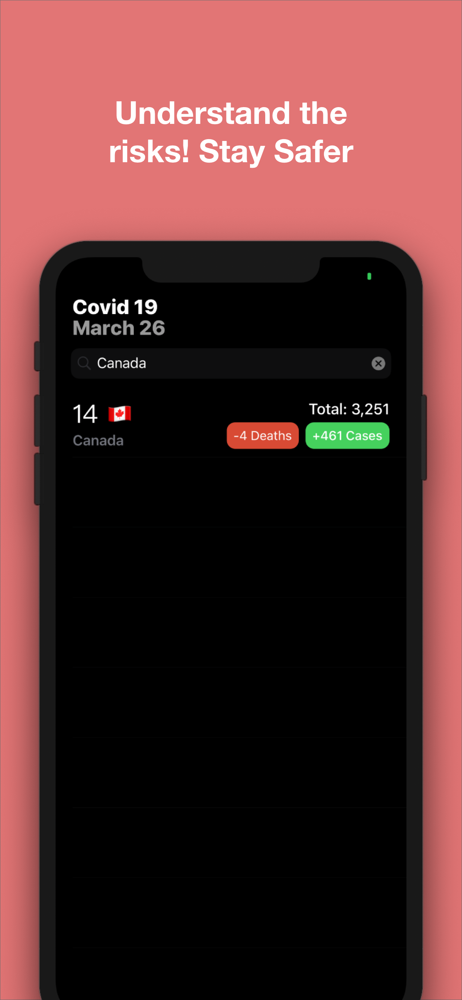

# COVID19-Stats-IOS

The COVID19 Stats app is designed to be a fast convenient way to check realtime statistics about the ongoing Coronavirus Outbreak. 

This data is provided by Johns Hopkins University Center for Systems Science and Engineering (JHU CSSE).

Key Components included in App: 
- Using Tableview and Custom Tablecells
- HTTPS call to retrieve JSON Data
- Creating custom Objects and decoding JSON to Object
- Using UISeachbar with Tableview

Screenshots:

